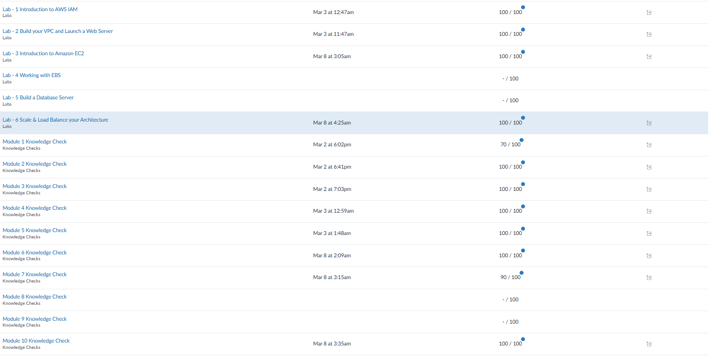

### 1. What metrics would you use for your website serving as:
* **A webshop for a travel agency:** Page load time, cart abandonment rate, database query latency, CPU/memory usage
* **A streaming music website:** Concurrent streams, cache hit ratio, CPU/memory usage
* **An environment monitoring server collecting sensor data:** Processing latency, failed uploads rates, CPU/memory usage

### 2. What is the benefit of using a dashboard compared to individual service metrics?
A dashboard combines metrics and settings from multiple services into a single, centralized interface, where each subinterface is easily accessible, allowing more complete control and monitoring of the overall system.

### 3. What is an Event Bus? How can you use it with your application? What are its inputs and outputs?
Event bus is an event router (like Amazon EventBridge) that facilitates communication between microservices by receiving events and routing them to target destinations. It can be used to trigger automated workflows in the application when specific state changes occur.
The examplery inputs can be AWS services, such as an EC2 instance state change, or for example, custom application events. On the other other hand, possible outputs can be AWS Lambda functions, or AWS Step Functions.

### 4. What tools for log collection and analysis does AWS provide in addition to CloudWatch? What supporting services are involved? What are the costs of logging and analysis?
In addition to CloudWatch, AWS provides Amazon OpenSearch Service for indexing and searching logs, and Amazon Athena for querying logs stored directly in S3. 
Moreover, among the supporting services, we can include services like Amazon S3, Amazon Kinesis Data Firehose, and AWS CloudTrail. 
Finally, costs are typically calculated through the amount of data loaded, storage consumed, and compute resources used for analysis.

### 5. What is the use of CloudWatch Alarms? How are alarms related to metrics? What other AWS services can be used with alarms? (Hint: Consider SNS and others.)
CloudWatch Alarms are used to automatically monitor metrics and send notifications and/or trigger automated actions when a set limit is traversed.
Other Amazon services that can employ CloudWatch Alarms are Amazon SNS (for sending email/SMS alerts), Amazon EC2 Auto Scaling (to add/remove instances automatically), and Amazon EC2 (to reboot or recover instances).

### 6. Is metrics collection different for AMI/VMs, serverless/Lambda, and containerized applications?
Yes, they vary. For AMIs/VMs, basic infrastructure metrics are collected, but metrics like memory and disk space require manual installation of the CloudWatch Agent. 
On the other hand, AWS Lambda sends metrics to CloudWatch without agents, since AWS manages the infrastructure. 
Finally, containerized applications require additional tools, which use embedded agents to gather cluster, node, and pod-level data.

