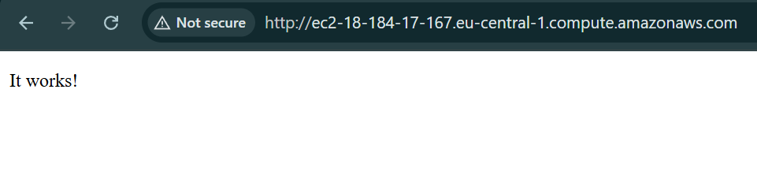
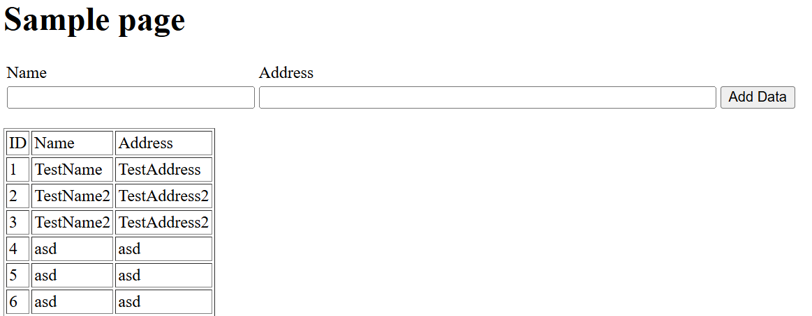
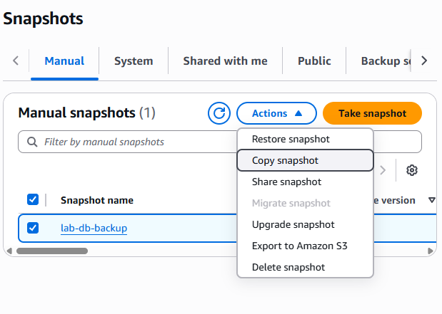
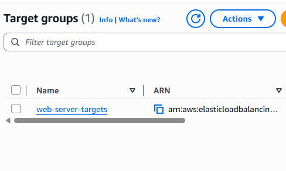
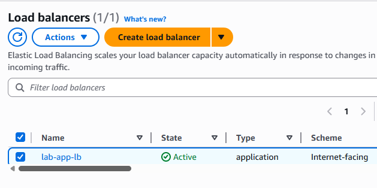
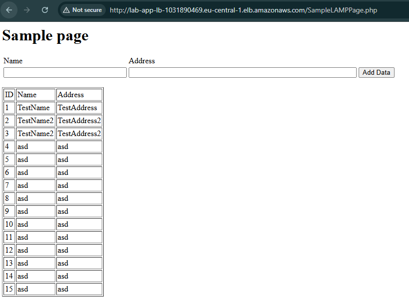
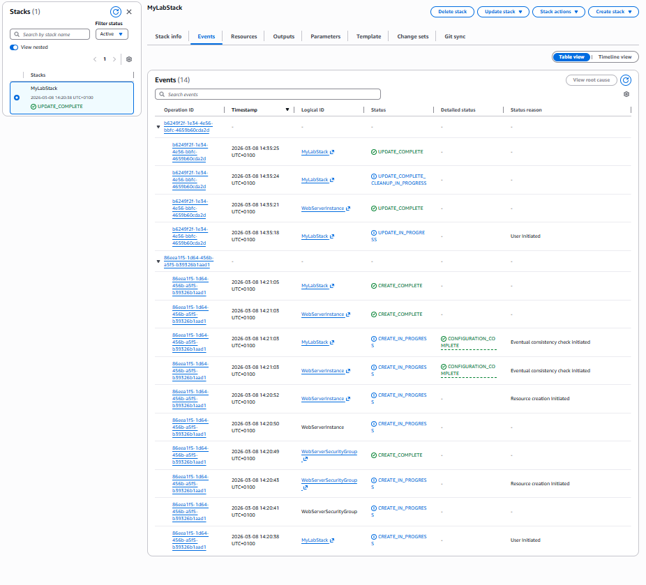

## 3.1 Questions
### 1. What is the purpose of the "Parameters" section in a CloudFormation template? Is it secure to store passwords in the template?
The "Parameters" section lets you input custom values into your template at the time of stack creation or update, allowing a single template to be reused across different environments without the need for any underlying code change. 
To address the security, question - I don't think that it is a good idea to store passwords there, since it is sensitive passwords or other sensitive data in plaintext directly within the template. But AWS offers services to ensure the security of credentials/secrets, such as AWS Secrets Manager or AWS Systems Manager Parameter Store.
### 2. What operations does CloudFormation automate, and which must be manually defined? How do you do this?
CloudFormation automates the entire lifecycle of the infrastructure creation, including provisioning, updating, and deleting resources, and also handling complex dependencies; however, the logic related to configuration is not automated.
### 3. Why is an SSH key required for CloudFormation, and how is it specified? Why does CloudFormation require an existing key?
An SSH key is required to provide a secure method for admin access to the EC2 instances after their launch. The admin can then log in and manage the system directly.
Furthermore, CloudFormation requires an existing key because AWS does not generate or store private keys for you.
### 4. You need to create a fleet of webservers and other resources. What is the structure of CloudFormation template for this case? What are solutions for this with using CloudFormation and/or other cloud automation tools? Provide an example of what functionalities are available in Ansible (e.g., modules and/or tasks).
In order to create a fleet of webserver the CloudFormation template structure would include an Auto Scaling Group and a Launch Template, and an Elastic Load Balancer to distribute traffic and Security Groups to control network access. 
Terraform is comparable to CloudFormation in its capabilities. On the other hand, Ansible provides a different approach by focusing on configuration management through modules, which are organized into tasks to ensure that the server reaches a specific state.
### 5. Which CloudFormation functions can be done in Ansible and which cannot? Provide example of both. How do Ansible and CloudFormation interact during the deployment process?
Both CloudFormation and Ansible can provide infrastructure resources like EC2 instances. But Ansible is much more powerful for guest-level configuration. CloudFormation, on the other hand, is better at high-level state management and can automatically roll back the entire stack if a resource fails to be created. 
In a typical deployment process, CloudFormation is used to build the "virtual hardware", and then Ansible is usually triggered via a CI/CD pipeline or a script to install some software patches.